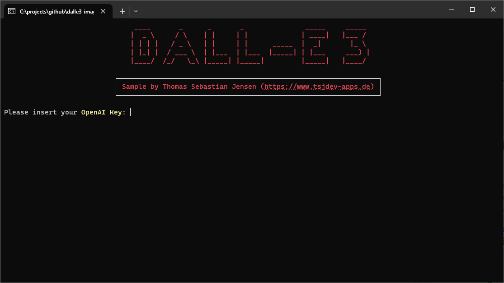
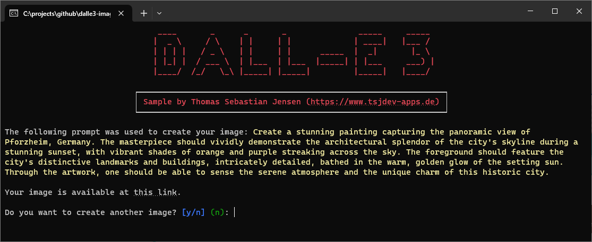

# Image Generation with DALL-E 3

This repository contains a simple console application written in .NET 7 to demonstrate how to generate images using the DALL-E 3 API provided by [OpenAI](https://openai.com).

## Usage

You need to create an OpenAI account on this [website](https://platform.openai.com/docs/overview). You have to pay to use the API so make sure that you add your payment information. After that, you can create an API Key [here](https://platform.openai.com/api-keys) for further use.

Just run the app and follow the steps displayed on the screen.

## Screenshots

Here you can see the console application in action:

Here is the generated image of a skyline from New York City:

## Blog Post

If you are more interested into details, please see the following [medium.com](https://www.medium.com) post:

- [Use OpenAI’s DALL-E 3 to generate stunning images](https://medium.com/medialesson/use-openais-dall-e-3-to-generate-stunning-images-ef1a301bc046)